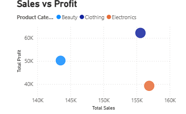

#  Retail Performance & Customer Insights Dashboard

##  Overview

This project explores retail transaction data to evaluate overall business performance, customer purchasing trends, and product-level outcomes using an interactive Power BI dashboard.

---

##  Objective

The goal of this analysis is to understand how different factors such as customer demographics, product categories, and pricing strategies influence overall business performance.

---

##  Approach

### Data Processing

* Organized and cleaned raw transaction data
* Standardized columns for consistency

### Data Enrichment

To enhance analysis, additional fields were introduced:

* **Revenue** derived from transaction values
* **Estimated Profit** calculated using assumed margins
* **Discount Values** to simulate pricing strategies
* **Customer Groups** based on age classification
* **Region Mapping** for location-based analysis

### Dashboard Development

* Built dynamic visuals in Power BI
* Designed KPI indicators for quick insights
* Applied filters and slicers for interactive exploration

---

##  Key Metrics

* Total Revenue: 456K
* Estimated Profit: 151K
* Customer Count: 1000
* Average Transaction Value: 456

---

##  Observations

* Certain product categories contribute significantly to revenue but not equally to profit
* Customer purchasing behavior varies across different age groups
* Pricing adjustments (discounts) influence overall profitability
* Sales distribution differs across simulated regions

---

##  Insights

* High sales volume does not always result in high profitability
* Customer segmentation helps identify valuable customer groups
* Strategic pricing plays a key role in improving margins

---

##  Tools & Technologies

* Power BI
* Data Transformation
* DAX Calculations
* CSV Dataset

---

##  Dashboard Snapshot

---

##  Project Contents

* Power BI File (`retail_dashboard.pbix`)
* Dataset (`retail_sales_data.csv`)
* Dashboard visuals

---

##  Summary

This project highlights how retail data can be leveraged to gain insights into performance trends and support better decision-making.

---

